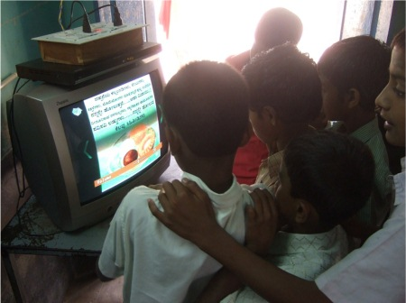

## Abstract
While many technologies remain out-of-reach for households in the developing world, one exception to this rule is that of entertainment technologies. Even in poor communities, there is a strong drive to own devices such as TVs and, increasingly, DVD players. Though they are typically used for video content, ordinary DVD players also support rich interactivity and programmability. We have leveraged these capabilities to support interactive applications - such as encyclopedias, language tutoring, and medical decision systems - without any dependence on a computer.

<table>
    <tr>
    <td><ul>
        
        <li><h5>Artifacts</h5></li>
        <li class="projects-li-items"><a href="javascript:LoadImage('../old_site/media/images/interactiveDvd.jpg')">Classroom Deployment</a></li>
        <li class="projects-li-items"><a href="javascript:LoadImage('../old_site/media/images/interactiveDvd_us2.jpg')">User Study</a></li>
        <li class="projects-li-items"><a href="javascript:LoadImage('../old_site/media/images/interactiveDVD_ui1.jpg')">Children Books 1</a></li>       

        <li class="projects-li-items"><a href="javascript:LoadImage('../old_site/media/images/interactiveDVD_ui2.jpg')">Children Books 2</a></li>   
        <li class="projects-li-items"><a href="javascript:LoadImage('../old_site/media/images/htmlDVD_ui1.jpg')">Wikipedia on DVD 1</a></li>        
        <li class="projects-li-items"><a href="javascript:LoadImage('../old_site/media/images/htmlDVD_ui2.jpg')">Wikipedia on DVD 2</a></li>    
        <li>&nbsp;</li>
        <li class="projects-li-items"><h5>Responsibilities</h5></li>
        <li class="projects-li-items">Prototyping and Testing</li>
        <li class="projects-li-items">Iterative Design</li>
        <li class="projects-li-items">Development in C#</li>
        <li class="projects-li-items">Study Design</li>
        <li class="projects-li-items">Usability Evaluation</li>
        <li>&nbsp;</li>

        </ul></td>
        <td class="project-image">
        

        
        

        </td>
    </tr>
        
</table>


